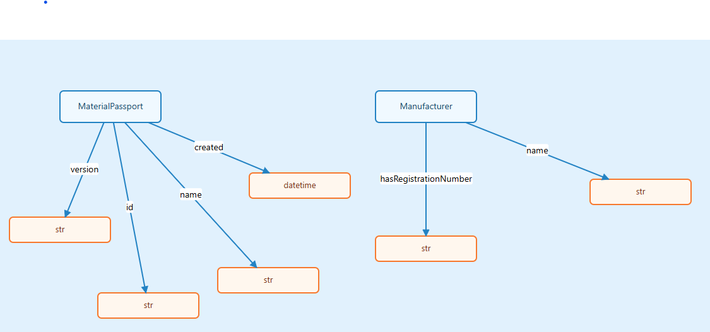
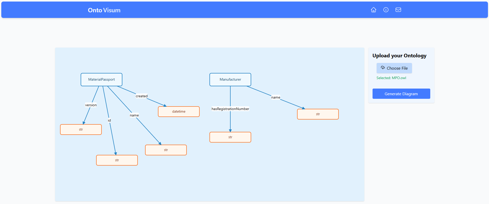
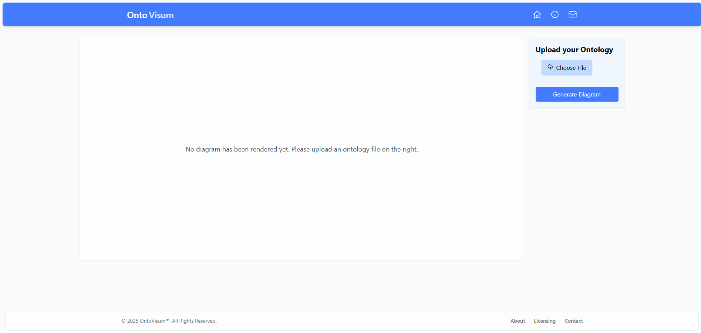

# OntoVisum
> An ontology visualiser

A web application for uploading, parsing and visualising ontology files in an interactive, user friendly interface.

## Features

### Ontology Upload
Upload `.owl` or other ontology files via a clean and simple upload panel.

### Diagram Rendering
Automatically generates ontology diagrams using JointJS, showing:
- Ontology classes.
- Data properties.
- Property relationships between classes and values.

### Responsive Layout
- Main canvas on the left, upload panel on the right.
- Styled with Tailwind CSS for a modern look.

### Sticky Nav-Bar
Navigation remains visible at the top of the screen even whilst scrolling.

### Pages & Navigation
- **Home:** Main diagram viewer and uploader.
- **About:** Information about the app. (Yet to develop)
- **Contact:** Conact Details. (Yet to develop)
- Navigation will be dealt with the React router.

### Alert Messages
- Slide-down alert for missing uploads before generating diagrams.
- Automatically disappears after a few seconds.

## Tech Stack

- **Frontend Framework:** React (with TypeScript)
- **UI Styling:** Tailwind CSS
- **Diagram Rendering API:** JoinJS
- **Backend Language & API:** Python & Owlready2

## Running the Application

### 1. Clone the Repository

```bash
git clone https://github.com/your-username/ontovisum.git
cd ontovisum
```

### 2. Start the Backend Server

```bash
cd backend/
uvicorn main:app --reload
```

### 3. Start the Frontend Server

```bash
cd frontend/
npm install
npm run dev
```

## Screenshots





## Future Improvement Goals

- Support for larger ontology files.
- Dark mode.
- Save and export diagram.

## License
> MIT License